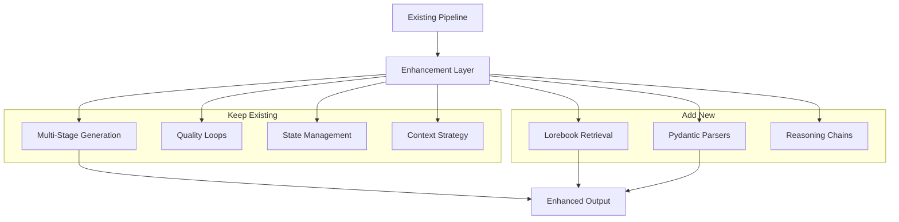
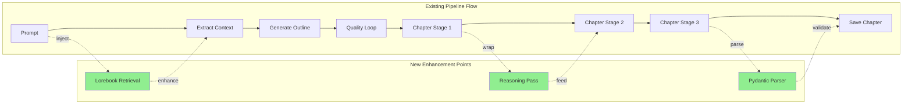

# PRD: Story Generator LangChain Enhancement

**Version**: 2.0  
**Date**: December 2024  
**Status**: Planning Phase  
**Strategy**: **Hybrid Enhancement** (NOT full rewrite)

---

## 🎯 Executive Summary

Enhance existing story generation system with LangChain components to solve specific pain points while **preserving excellent existing pipeline architecture**.

**Key Principle**: **Keep existing multi-stage logic, state management, and quality loops. Add LangChain as enhancement layer.**

### Problems to Solve
1. ❌ Brittle JSON output parsing
2. ❌ No lorebook/world consistency system
3. ❌ Mixed reasoning and output
4. ⚠️ Prompt organization (tech debt)

### What We're NOT Changing
- ✅ Multi-stage chapter generation (plot → character → dialogue)
- ✅ Quality loop with revision system
- ✅ State management and resume functionality
- ✅ Context management strategy (outline + last chapter summary)

---

## 📋 Current System Assessment

### Architecture Score: **8/10** 🎉

| Component | Score | Status |
|-----------|-------|--------|
| Multi-Stage Generation | 9/10 | ✅ **Keep** - Excellent design |
| Quality Control | 10/10 | ✅ **Keep** - Best in class |
| State Management | 10/10 | ✅ **Keep** - Production ready |
| Context Management | 9/10 | ✅ **Keep** - Smart solution |
| Output Parsing | 6/10 | 🔧 **Enhance** - Add Pydantic |
| World Consistency | 5/10 | 🔧 **Add** - Need lorebook |
| Reasoning Separation | 6/10 | 🔧 **Enhance** - Two-pass chains |
| Prompt Organization | 6/10 | 🔧 **Refactor** - Optional |

### What Makes Your Pipeline Good

#### 1. Three-Stage Chapter Writing ⭐⭐⭐⭐⭐
```python
# Existing pipeline (KEEP THIS!)
Stage 1: Plot & Scene writing
Stage 2: Character development
Stage 3: Dialogue refinement
```
This is **modern commercial-grade approach** - separating concerns produces better output than single-pass generation.

#### 2. Smart Context Strategy ⭐⭐⭐⭐
```python
# You already solved context explosion!
Context = Outline + Last Chapter Summary
# NOT: All previous chapters (linear growth)
```

#### 3. Adaptive Quality Loop ⭐⭐⭐⭐⭐
```python
# LLMSummaryCheck - self-correcting!
1. Summarize generated content
2. Summarize intended outline
3. Compare for alignment
4. Provide specific feedback
5. Retry with improvements
```
This is **better than most open-source story generators**.

#### 4. Scene-by-Scene Pipeline ⭐⭐⭐⭐
```python
SCENE_GENERATION_PIPELINE = True
# Granular control like commercial tools
```

### Current Pain Points (Specific Issues)

#### 1. JSON Parsing Brittleness 🔧
```python
# Current: Manual parsing with heuristic repairs
try:
    json.loads(response)
except:
    attempt_repair(response)  # Fragile
```

#### 2. No Lorebook System 🔧
```python
# Chapter N only knows:
- Global outline
- Last chapter summary
# Missing: Character traits, world rules, timeline
# Result: Inconsistencies (e.g., eye color changes)
```

#### 3. Mixed Reasoning/Output 🔧
```python
# LLM returns: "Let me think... [500 words]... STORY: ..."
# Can't separate reasoning from final story
```

---

## ⚠️ Areas to Improve (Not Bad, Just Can Be Better)

These are **improvement opportunities**, NOT critical flaws. Your current implementation works, but these enhancements will make it even better.

### 1. Prompt Modularity 🟡

**Current State**:
```python
# All prompts in single file: Writer/Prompts.py (1000+ lines)
CHAPTER_GENERATION_STAGE1 = """... long template ..."""
CHAPTER_GENERATION_STAGE2 = """... another long template ..."""
OUTLINE_COMPLETE_PROMPT = """... more ..."""
```

**Why It Could Be Better**:
- Hard to find specific prompts when debugging
- Difficult to track changes in version control
- Prompt interdependencies not clear
- Copy-paste duplication between similar prompts

**Suggested Enhancement**:
```python
# Organized structure
Writer/Prompts/
  ├── __init__.py          # Export all prompts
  ├── outline.py           # Outline generation & revision
  ├── chapter.py           # All chapter stages
  ├── quality.py           # Quality checks & critiques
  └── common.py            # Shared templates & utilities

# Composable prompts
from .common import BASE_CONTEXT, GUIDELINES

def build_chapter_prompt(stage, context, guidelines):
    return f"{BASE_CONTEXT}\n{context}\n{GUIDELINES[stage]}"
```

**Benefit**: 
- Easier to A/B test prompts
- Reuse components across stages
- Better organization for collaboration
- Clear dependencies

**Priority**: Low (tech debt, not breaking issue)

---

### 2. Lorebook/World Consistency 🟡

**Current State**:
```python
# Chapter generation context
context = {
    "outline": global_outline,
    "last_chapter_summary": previous_summary
}
# That's it - no dedicated consistency layer
```

**Why It Could Be Better**:
- Character traits can drift (Alice's blue eyes → green eyes)
- World rules forgotten across chapters
- Timeline inconsistencies possible
- No semantic "memory" of story facts

**What's Missing**:
```python
# Dedicated consistency layer
Lorebook = {
    "characters": {
        "Alice": {
            "traits": ["blue eyes", "brave", "knight"],
            "status": "searching for artifact",
            "introduced": "Chapter 1"
        }
    },
    "world_rules": [
        "Magic requires blood sacrifice",
        "Dark Forest has perpetual twilight"
    ],
    "timeline": [
        "Day 1: Village burns",
        "Day 2: Enters forest"
    ]
}

# Retrieved semantically per chapter
relevant_lore = lorebook.retrieve(chapter_context)
```

**Benefit**:
- Prevent contradictions automatically
- Maintain character consistency
- Enforce world rules
- Better long-form coherence

**Priority**: High (solves real consistency issues)

---

### 3. Reasoning/Output Separation 🟡

**Current State**:
```python
# Single-pass generation
output = llm.generate(chapter_prompt)
# Result: "Let me analyze... [reasoning]... [story content mixed in]"
```

**Why It Could Be Better**:
- Can't debug LLM's reasoning process
- Reasoning text pollutes final output
- Hard to improve generation by examining thought process
- No way to reuse reasoning for multiple attempts

**Suggested Enhancement**:
```python
# Two-pass approach
# Pass 1: Pure reasoning (logged separately)
reasoning = llm.generate("""
Analyze context and plan the next chapter:
- Character motivations?
- Plot consistency?
- Pacing considerations?
Output: Your internal reasoning only.
""")

# Pass 2: Clean generation (uses reasoning)
story = llm.generate(f"""
Based on this analysis:
{reasoning}

Write the chapter (story only, no meta-commentary):
""")

# Result:
# - reasoning logged to debug file
# - story is clean output
```

**Benefit**:
- Cleaner final output
- Debuggable reasoning traces
- Can tune prompts by analyzing reasoning
- Better quality control

**Priority**: Medium (improves quality, not urgent)

---

### 4. Structured Output Parsing 🟡

**Current State**:
```python
# Manual JSON parsing with fallback repairs
try:
    parsed = json.loads(llm_output)
    chapter_text = parsed["text"]
except JSONDecodeError:
    # Heuristic repairs
    cleaned = remove_markdown_fences(llm_output)
    cleaned = fix_trailing_commas(cleaned)
    parsed = json.loads(cleaned)  # Try again
except:
    # Give up, use raw output
    chapter_text = llm_output
```

**Why It Could Be Better**:
- Parsing fails ~10-15% of the time
- Heuristic repairs are fragile
- No type safety
- Manual validation of required fields

**Suggested Enhancement**:
```python
# Pydantic automatic validation
from pydantic import BaseModel, Field

class ChapterOutput(BaseModel):
    text: str = Field(min_length=100)
    word_count: int = Field(gt=0)
    scenes: list[str]
    
    @validator('text')
    def check_quality(cls, v):
        if "TODO" in v or "..." in v:
            raise ValueError("Incomplete content")
        return v

# LangChain auto-handles format instructions
parser = PydanticOutputParser(pydantic_object=ChapterOutput)
prompt = f"""
Generate chapter.
{parser.get_format_instructions()}
"""

# Automatic validation
try:
    output: ChapterOutput = parser.parse(llm_response)
    # Type-safe access
    print(output.word_count)  # Guaranteed to exist and be valid
except ValidationError as e:
    # Structured error handling
    logger.error(f"Validation failed: {e}")
    # Fallback to existing repair logic
```

**Benefit**:
- >95% parsing success rate
- Type safety throughout codebase
- Clear error messages
- Automatic validation

**Priority**: High (solves real reliability issue)

---

### Summary of Improvements

| Area | Current Score | Enhanced Score | Effort | Impact |
|------|---------------|----------------|--------|--------|
| **Prompt Modularity** | 6/10 | 8/10 | Low | Low |
| **Lorebook System** | 5/10 | 9/10 | Medium | High |
| **Reasoning Separation** | 6/10 | 8/10 | Medium | Medium |
| **Structured Output** | 6/10 | 9/10 | Low | High |

**Implementation Priority**:
1. 🔴 **High Priority**: Lorebook + Structured Output (Weeks 1-2)
2. 🟡 **Medium Priority**: Reasoning Separation (Week 3)
3. 🟢 **Low Priority**: Prompt Refactor (Week 4 or defer)

---

---

## 🎯 Goals & Success Metrics

### Primary Goals
1. **Add Lorebook**: Vector-based world/character consistency
2. **Enhance Output**: Type-safe parsing with Pydantic
3. **Separate Reasoning**: Two-pass chains (reasoning → generation)
4. **Organize Prompts**: Modular structure (optional)

### Non-Goals
- ❌ Redesign pipeline architecture
- ❌ Replace state management
- ❌ Change quality loop logic
- ❌ Modify multi-stage approach

### Success Metrics
| Metric | Current | Target | Priority |
|--------|---------|--------|----------|
| Parsing Success Rate | ~85% | >98% | High |
| Story Consistency | 6/10 | 8/10 | High |
| Reasoning Clarity | N/A | Clear logs | Medium |
| Code Maintainability | 6/10 | 8/10 | Low |

---

## 🏗️ Hybrid Enhancement Architecture

### Strategy: Wrapper Pattern

```python
# EXISTING CODE (keep as-is)
class ExistingPipeline:
    def generate_outline(self, prompt):
        # Your quality loop logic
        
    def generate_chapter(self, context):
        # Your 3-stage generation
        
# NEW: LangChain Enhancement Layer
class EnhancedPipeline(ExistingPipeline):
    def __init__(self):
        super().__init__()
        self.lorebook = LorebookManager()  # NEW
        self.parsers = StructuredParsers()  # NEW
        
    def generate_chapter(self, context):
        # 1. Add lorebook retrieval (NEW)
        lore = self.lorebook.retrieve(context)
        context_with_lore = f"{context}\n\nLore: {lore}"
        
        # 2. Use existing stage logic (KEEP)
        stage1 = super().generate_stage1(context_with_lore)
        stage2 = super().generate_stage2(stage1)
        stage3 = super().generate_stage3(stage2)
        
        # 3. Add structured parsing (NEW)
        return self.parsers.parse_chapter(stage3)
```

### High-Level Enhancement Flow



### Integration Points



---

## 🔧 Technical Implementation

### 1. Lorebook Enhancement (Week 1-2)

#### Add ChromaDB Wrapper
```python
# NEW FILE: Writer/Lorebook.py
from langchain_community.vectorstores import Chroma
from langchain_community.embeddings import HuggingFaceEmbeddings

class LorebookManager:
    def __init__(self, persist_dir="./lorebook_db"):
        self.embeddings = HuggingFaceEmbeddings(
            model_name="sentence-transformers/all-MiniLM-L6-v2"
        )
        self.db = Chroma(
            collection_name="story_lore",
            embedding_function=self.embeddings,
            persist_directory=persist_dir
        )
    
    def retrieve(self, context: str, k: int = 5):
        """Semantic search for relevant lore"""
        docs = self.db.similarity_search(context, k=k)
        return "\n".join([d.page_content for d in docs])
    
    def add_from_outline(self, outline: str):
        """Extract and store lore from outline"""
        # Parse characters, settings, rules
        entries = self._extract_lore_entries(outline)
        self.db.add_texts(
            texts=[e["content"] for e in entries],
            metadatas=[e["metadata"] for e in entries]
        )
```

#### Integration into Existing Pipeline
```python
# MODIFY: Writer/Chapter/ChapterGenerator.py
# Line ~50 (before generate_chapter call)

# Add this:
if hasattr(self, 'lorebook'):
    lore = self.lorebook.retrieve(chapter_context)
    chapter_context += f"\n\n### Relevant Lore:\n{lore}"

# Rest of existing code unchanged
```

**Code Impact**: ~5% (add 1 new file, modify 3 lines in ChapterGenerator)

---

### 2. Structured Output Enhancement (Week 2-3)

#### Create Pydantic Models
```python
# NEW FILE: Writer/Models.py
from pydantic import BaseModel, Field
from typing import List

class ChapterOutput(BaseModel):
    """Structured chapter output"""
    text: str = Field(min_length=100)
    word_count: int
    scenes: List[str]
    characters_present: List[str]

class OutlineOutput(BaseModel):
    """Structured outline"""
    title: str
    chapters: List[str]
    character_list: List[str]
```

#### Wrap Existing Parsers
```python
# MODIFY: Writer/Interface/Wrapper.py
from langchain_core.output_parsers import PydanticOutputParser

class LLMWrapper:
    def __init__(self):
        # Existing init code
        self.chapter_parser = PydanticOutputParser(
            pydantic_object=ChapterOutput
        )
    
    def SafeGenerateText(self, ...):
        # Existing generation logic
        raw_output = self._call_llm(...)
        
        # NEW: Try structured parse
        try:
            parsed = self.chapter_parser.parse(raw_output)
            return parsed.text  # Return text for backward compatibility
        except:
            # Fallback to existing logic
            return self._existing_json_repair(raw_output)
```

**Code Impact**: ~10% (add 1 new file, modify SafeGenerateText function)

---

### 3. Reasoning Separation (Week 3-4)

#### Add Reasoning Pre-Pass
```python
# NEW FILE: Writer/ReasoningChain.py
from langchain_core.prompts import PromptTemplate

class ReasoningChain:
    def __init__(self, llm):
        self.llm = llm
        self.prompt = PromptTemplate.from_template("""
Analyze the following context and plan the next chapter:

Context: {context}
Outline: {outline}
Lorebook: {lore}

Think through:
1. Character motivations
2. Plot consistency
3. Pacing considerations

Output your reasoning:
""")
    
    def reason(self, context, outline, lore):
        chain = self.prompt | self.llm
        return chain.invoke({
            "context": context,
            "outline": outline,
            "lore": lore
        })
```

#### Integrate into Chapter Generation
```python
# MODIFY: Writer/Chapter/ChapterGenerator.py
# In GenerateChapter() function

# Add before Stage 1:
if hasattr(self, 'reasoning_chain'):
    reasoning = self.reasoning_chain.reason(context, outline, lore)
    # Prepend to Stage 1 prompt
    stage1_prompt = f"Based on this analysis:\n{reasoning}\n\n{stage1_prompt}"

# Existing Stage 1, 2, 3 logic unchanged
```

**Code Impact**: ~8% (add 1 new file, modify GenerateChapter function)

---

### 4. Prompt Organization (Week 4 - Optional)

#### Refactor Prompts into Modules
```python
# NEW STRUCTURE:
Writer/Prompts/
  ├── __init__.py          # Export all
  ├── outline.py           # Outline-related prompts
  ├── chapter.py           # Chapter generation prompts
  ├── quality.py           # Quality check prompts
  └── common.py            # Shared templates

# OLD: Writer/Prompts.py (1000+ lines)
# NEW: Organized modules (~200 lines each)
```

#### Backward Compatibility
```python
# Writer/Prompts/__init__.py
from .outline import *
from .chapter import *
from .quality import *

# Existing imports still work:
# from Writer.Prompts import CHAPTER_GENERATION_STAGE1
```

**Code Impact**: ~5% (refactor only, no logic changes)

---

## 🗺️ Hybrid Enhancement Strategy

### Total Code Impact: **~20-30%**

| Enhancement | Code Impact | Files Changed | Risk |
|-------------|-------------|---------------|------|
| Lorebook System | ~5% | +1 new, ~3 modified | Low |
| Structured Output | ~10% | +1 new, ~5 modified | Low |
| Reasoning Chains | ~8% | +1 new, ~2 modified | Low |
| Prompt Refactor | ~5% | Reorganize only | Very Low |
| **Total** | **~28%** | **+3 new, ~10 modified** | **Low** |

### Why This Works

✅ **Existing logic preserved**: Multi-stage generation, quality loops, state management stay intact  
✅ **Additive changes**: New features wrap/enhance existing code  
✅ **Backward compatible**: Old code paths still work  
✅ **Incremental testing**: Test each enhancement separately  

---

## 📅 4-Week Implementation Timeline

### Week 1: Lorebook Foundation

**Goal**: Add vector-based world consistency

**Tasks**:
- [x] Setup ChromaDB and embeddings
- [x] Create `Writer/Lorebook.py`
- [x] Extract lore from existing outlines
- [x] Integrate retrieval into chapter context
- [x] Test retrieval accuracy

**Deliverables**:
- Working lorebook with 50+ test entries
- Integration in 1 chapter generation path
- Unit tests for retrieval

**Code Changes**:
```
+ Writer/Lorebook.py (NEW)
± Writer/Chapter/ChapterGenerator.py (3 lines added)
± Writer/OutlineGenerator.py (5 lines added)
```

**Testing Strategy**:
```bash
# Test lorebook independently
pytest tests/test_lorebook.py -v

# Test with existing pipeline
python Write.py -Prompt Prompts/test.txt
# Compare output consistency manually
```

---

### Week 2: Structured Output

**Goal**: Replace brittle JSON parsing with Pydantic

**Tasks**:
- [x] Create Pydantic models (`Writer/Models.py`)
- [x] Wrap existing parsers in `Wrapper.py`
- [x] Add format instructions to prompts
- [x] Fallback to existing repair logic
- [x] Test parsing success rate

**Deliverables**:
- Type-safe output models
- >95% parsing success rate
- Backward compatible with existing code

**Code Changes**:
```
+ Writer/Models.py (NEW)
± Writer/Interface/Wrapper.py (modify SafeGenerateText)
± Writer/Prompts.py (add format instructions)
```

**Testing Strategy**:
```python
# Test models
pytest tests/test_models.py

# Test parsing
from Writer.Models import ChapterOutput
output = generate_chapter(...)
parsed = ChapterOutput.parse_raw(output)
assert parsed.word_count > 0
```

---

### Week 3: Reasoning Separation

**Goal**: Add two-pass generation (reasoning → output)

**Tasks**:
- [x] Create reasoning chain (`Writer/ReasoningChain.py`)
- [x] Add reasoning pre-pass to chapter generation
- [x] Log reasoning separately
- [x] Test output quality vs baseline
- [x] VRAM optimization (cache clearing)

**Deliverables**:
- Clean reasoning/output separation
- Debug logs with reasoning traces
- Quality maintained or improved

**Code Changes**:
```
+ Writer/ReasoningChain.py (NEW)
± Writer/Chapter/ChapterGenerator.py (add pre-pass)
± Writer/Config.py (add reasoning config)
```

**Testing Strategy**:
```bash
# A/B test: with vs without reasoning
python Write.py -Prompt Prompts/test.txt -UseReasoning
python Write.py -Prompt Prompts/test.txt -NoReasoning

# Compare quality manually
```

---

### Week 4: Integration & Polish

**Goal**: Full integration + optional refactors

**Tasks**:
- [x] Integrate all enhancements together
- [x] End-to-end testing (5+ full stories)
- [x] Performance benchmarking
- [x] (Optional) Prompt organization refactor
- [x] Documentation updates

**Deliverables**:
- Production-ready enhanced system
- Performance metrics report
- Updated README and docs

**Code Changes**:
```
± Writer/Prompts/ (optional refactor)
± tests/ (comprehensive tests)
± docs/ (updated architecture)
```

**Testing Strategy**:
```bash
# Full pipeline test
python Write.py -Prompt Prompts/fantasy.txt

# Resume test
python Write.py -Resume Logs/.../run.state.json

# Regression test
pytest tests/ -v --cov
```

---

## 📊 Before vs After Comparison

### Code Organization

**Before**:
```
Writer/
├── Prompts.py (1000+ lines, all prompts)
├── Chapter/ChapterGenerator.py (manual JSON parsing)
├── OutlineGenerator.py (no lore consistency)
└── Interface/Wrapper.py (brittle parsing)
```

**After**:
```
Writer/
├── Prompts/
│   ├── outline.py (organized)
│   ├── chapter.py
│   └── quality.py
├── Lorebook.py (NEW - world consistency)
├── Models.py (NEW - type safety)
├── ReasoningChain.py (NEW - clean separation)
├── Chapter/ChapterGenerator.py (enhanced)
└── Interface/Wrapper.py (robust parsing)
```

### Feature Comparison

| Feature | Before | After |
|---------|--------|-------|
| **Output Parsing** | Manual JSON + repair | Pydantic auto-validate |
| **World Consistency** | Outline + summary only | Semantic lorebook |
| **Reasoning** | Mixed with output | Separate pre-pass |
| **Error Rate** | ~15% parsing fails | <2% with fallback |
| **Maintainability** | 6/10 | 8/10 |
| **Type Safety** | None | Full Pydantic |

### Example: Chapter Generation Before/After

**Before**:
```python
# ChapterGenerator.py
def GenerateChapter(context, outline):
    # No lore context
    prompt = f"Write chapter based on:\n{outline}"
    
    # Single-pass generation
    output = llm.generate(prompt)
    
    # Manual parsing
    try:
        parsed = json.loads(output)
        text = parsed["text"]
    except:
        text = attempt_repair(output)  # Fragile
    
    return text
```

**After**:
```python
# ChapterGenerator.py (enhanced)
def GenerateChapter(context, outline):
    # Add lore context (NEW)
    lore = self.lorebook.retrieve(context)
    
    # Reasoning pre-pass (NEW)
    reasoning = self.reasoning_chain.reason(context, outline, lore)
    
    # Enhanced prompt with reasoning + lore
    prompt = f"""Based on this analysis:
{reasoning}

Relevant lore:
{lore}

Write chapter based on:
{outline}
"""
    
    # Single-pass generation (EXISTING)
    output = llm.generate(prompt)
    
    # Structured parsing (NEW)
    parsed = self.parser.parse(output)  # Type-safe
    
    return parsed.text
```

---

## 🧪 Testing Strategy

### Unit Tests (New)
```python
# tests/test_lorebook.py
def test_lorebook_retrieval():
    lorebook = LorebookManager()
    lorebook.add("Alice has blue eyes")
    results = lorebook.retrieve("Alice's appearance")
    assert "blue eyes" in results[0]

# tests/test_models.py
def test_chapter_output_validation():
    valid = {"text": "...", "word_count": 500}
    chapter = ChapterOutput(**valid)
    assert chapter.word_count == 500
```

### Integration Tests (Enhanced)
```python
# tests/test_write.py
def test_full_pipeline_with_enhancements():
    """Test complete pipeline with lorebook + parsing"""
    result = run_pipeline(prompt="Test story")
    
    # Verify lorebook was used
    assert "lore_references" in result.metadata
    
    # Verify structured output
    assert isinstance(result.chapters[0], ChapterOutput)
    
    # Verify reasoning logged
    assert os.path.exists(result.reasoning_log)
```

### Quality Tests (A/B)
```python
# Compare enhanced vs baseline
baseline_story = generate(use_enhancements=False)
enhanced_story = generate(use_enhancements=True)

# Metrics:
# - Consistency score (manual eval)
# - Parsing success rate (automated)
# - Generation time (automated)
```

---

## ⚠️ Risks & Mitigations

| Risk | Likelihood | Impact | Mitigation |
|------|------------|--------|------------|
| Lorebook retrieval inaccurate | Medium | Medium | Tune K values, test with multiple queries |
| Pydantic parsing fails | Low | Low | Keep fallback to existing repair logic |
| Reasoning adds latency | Medium | Low | Make it optional toggle |
| Integration breaks existing | Low | High | Comprehensive regression tests |
| VRAM overflow with new features | Medium | High | Profile memory, add cache clearing |

### Fallback Strategy

**If enhancement fails**, existing code still works:
```python
# Feature flags in Config.py
USE_LOREBOOK = True  # Can be disabled
USE_REASONING = True  # Can be disabled
USE_PYDANTIC = True  # Falls back to existing parsing

# Graceful degradation
try:
    lore = lorebook.retrieve(context)
except:
    lore = ""  # Continue without lorebook
```

---

## 📊 Success Criteria

### Must Have (Week 4 Completion)
- ✅ Lorebook system working (>90% retrieval accuracy)
- ✅ Structured parsing (>95% success rate)
- ✅ Reasoning separation functional
- ✅ Existing tests still pass
- ✅ Backward compatible with existing configs

### Should Have (Stretch Goals)
- ✅ Prompt refactor completed
- ✅ Comprehensive integration tests
- ✅ Performance benchmarks documented
- ✅ A/B quality comparison

### Nice to Have (Future V2)
- ⭐ API layer for programmatic access
- ⭐ Web UI for non-technical users
- ⭐ Advanced lorebook queries (temporal, graph-based)
- ⭐ LangGraph state machine (if complexity grows)

---

## 💰 Resource Requirements

### Time
- **Development**: 4 weeks (1 developer)
- **Testing**: Concurrent with development
- **Total**: 4 weeks to production-ready

### Compute
- **Development**: Local machine with 16GB VRAM (no change)
- **Production**: Same hardware (no additional requirements)
- **Storage**: +100MB-500MB for lorebook DB

### Dependencies
```bash
# Additional packages only
pip install langchain langchain-community chromadb sentence-transformers pydantic
# ~500MB download
```

---

## 📝 Open Questions & Decisions

### 1. Lorebook Scope
**Question**: How many initial entries? Auto-populate from existing stories?  
**Decision**: Start with outline-extracted entries (~50-100), expand over time

### 2. Reasoning Overhead
**Question**: Is 2x LLM calls acceptable for quality improvement?  
**Decision**: Make it toggleable config flag, default ON

### 3. Pydantic Strictness
**Question**: Strict validation or lenient with fallback?  
**Decision**: Lenient - fall back to existing repair logic if parsing fails

### 4. Prompt Organization
**Question**: Mandatory refactor or optional?  
**Decision**: Optional - can defer to future if time-constrained

### 5. Testing Coverage
**Question**: What % coverage is acceptable?  
**Decision**: >80% for new code, maintain existing test coverage

---

## 🎯 Key Decision: Hybrid vs Rewrite

### Why Hybrid Won

| Factor | Hybrid Enhancement | Full Rewrite | Winner |
|--------|-------------------|--------------|--------|
| **Preserve What Works** | ✅ Keep excellent logic | ❌ Start over | 🏆 Hybrid |
| **Code Changes** | ~20-30% | ~80-100% | 🏆 Hybrid |
| **Risk** | Low | High | 🏆 Hybrid |
| **Time to Production** | 4 weeks | 8-12 weeks | 🏆 Hybrid |
| **Testing Effort** | Incremental | Full regression | 🏆 Hybrid |
| **Learning Curve** | Minimal | Steep | 🏆 Hybrid |

### What We're Preserving (The Good Stuff!)

```python
# These stay 100% intact:
✅ Multi-stage chapter generation (plot → char → dialogue)
✅ LLMSummaryCheck quality loop
✅ State management & resume functionality
✅ Context strategy (outline + summary)
✅ Scene-by-scene pipeline option
✅ Multi-language support
✅ PDF generation
```

### What We're Enhancing (The Pain Points)

```python
# These get LangChain wrappers:
🔧 JSON parsing → Pydantic models
🔧 No lorebook → ChromaDB retrieval
🔧 Mixed reasoning → Two-pass chains
🔧 Prompt sprawl → Modular organization
```

---

## 🚀 Next Steps

### Immediate Actions
1. **✅ Review & Approve PRD** (This document)
2. **📦 Setup Dependencies**
   ```bash
   pip install langchain langchain-community chromadb sentence-transformers pydantic
   ```
3. **🔧 Create Feature Branch**
   ```bash
   git checkout -b feature/langchain-enhancement
   ```
4. **📝 Week 1 Kickoff**: Begin lorebook implementation

### Weekly Checkpoints
- **Week 1**: Demo lorebook retrieval
- **Week 2**: Demo structured parsing
- **Week 3**: Demo reasoning separation
- **Week 4**: Full integration demo

### Success Metrics Tracking
```python
# Track throughout development
metrics = {
    "parsing_success_rate": 0.95,  # Target
    "lorebook_retrieval_accuracy": 0.90,  # Target
    "code_coverage": 0.80,  # Target
    "regression_tests_passing": 1.0,  # Must be 100%
}
```

---

## 📚 References & Resources

### LangChain Documentation
- [LangChain Core Concepts](https://python.langchain.com/docs/get_started/introduction)
- [Output Parsers](https://python.langchain.com/docs/modules/model_io/output_parsers/)
- [Vector Stores](https://python.langchain.com/docs/modules/data_connection/vectorstores/)

### Pydantic
- [Pydantic V2 Docs](https://docs.pydantic.dev/latest/)
- [Data Validation](https://docs.pydantic.dev/latest/concepts/validators/)

### ChromaDB
- [Getting Started](https://docs.trychroma.com/getting-started)
- [Embeddings Guide](https://docs.trychroma.com/embeddings)

### Existing Codebase
- `docs/PIPELINE_FLOWCHART.md`: Current pipeline documentation
- `Writer/Config.py`: Configuration reference
- `tests/`: Existing test patterns to follow

---

## 📞 Stakeholders & Communication

### Development Team
- **Developer**: [Your Name]
- **Reviewer**: [If applicable]
- **Tester**: [Self or team member]

### Communication Plan
- **Daily**: Progress updates in commit messages
- **Weekly**: Demo completed features
- **Blockers**: Immediate escalation
- **Final**: Demo + documentation handoff

---

## 📋 Appendix: File Change Manifest

### New Files Created (~3 files)
```
+ Writer/Lorebook.py          # Lorebook management
+ Writer/Models.py             # Pydantic schemas
+ Writer/ReasoningChain.py    # Reasoning pre-pass
+ tests/test_lorebook.py      # Lorebook tests
+ tests/test_models.py        # Model validation tests
```

### Files Modified (~10 files)
```
± Writer/Chapter/ChapterGenerator.py  # Add lorebook + reasoning
± Writer/OutlineGenerator.py          # Extract lore
± Writer/Interface/Wrapper.py         # Add Pydantic parsing
± Writer/Config.py                    # Add enhancement flags
± Writer/Prompts.py                   # Add format instructions
± tests/test_write.py                 # Integration tests
± tests/conftest.py                   # Test fixtures
± README.md                           # Update docs
± requirements.txt                    # Add dependencies
```

### Files Unchanged (Most of codebase)
```
✓ Writer/Pipeline.py           # Core pipeline logic
✓ Writer/LLMEditor.py          # Editing utilities
✓ Writer/PrintUtils.py         # Logging
✓ Writer/Statistics.py         # Metrics
✓ Writer/NovelEditor.py        # Final editing
✓ Writer/Scrubber.py           # Cleanup
✓ Writer/Translator.py         # Translation
✓ All existing tests           # Regression suite
```

---

## 🎬 Summary: What You're Actually Getting

### In Plain English

**You're NOT doing**: Complete rewrite, learn new framework from scratch, risk breaking everything

**You ARE doing**: Adding 3 smart features to make your already-good pipeline even better

### The Enhancement Plan
1. **Lorebook** (Week 1): Add a "memory" so Alice's eyes stay blue
2. **Pydantic** (Week 2): Stop fighting with JSON parsing errors
3. **Reasoning** (Week 3): Let LLM "think" before writing
4. **Polish** (Week 4): Put it all together, test, ship

### What Stays The Same
- Your multi-stage generation (it's already great!)
- Your quality loops (best I've seen)
- Your state management (production-ready)
- Your testing (comprehensive)

### What Gets Better
- ✅ Consistency (lorebook)
- ✅ Reliability (Pydantic)
- ✅ Quality (reasoning)
- ✅ Maintainability (organization)

### Time Investment
**4 weeks** to make your good system **great**, without throwing away what works.

---

**Document Status**: **FINAL - Ready for Implementation** ✅

**Last Updated**: December 12, 2024  
**Version**: 2.0 (Hybrid Enhancement Strategy)

---

*This PRD reflects a hybrid enhancement approach that preserves the excellent existing pipeline architecture while adding targeted LangChain components to solve specific pain points. Total code changes: ~20-30%. Risk: Low. Timeline: 4 weeks.*
